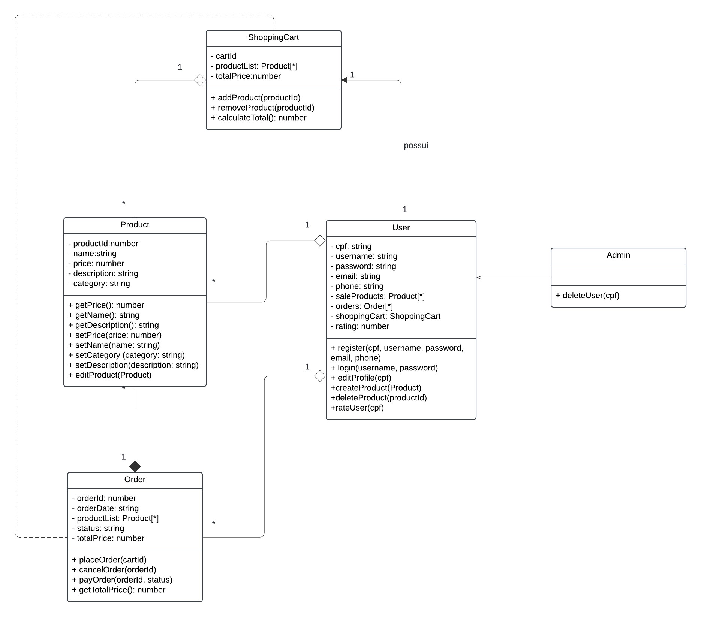
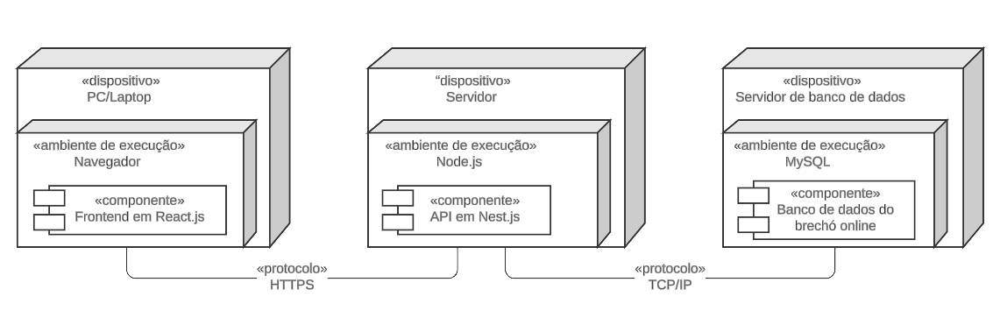

# 2.1. Módulo Notação UML – Modelagem Estática

## 2.1.1 - Diagrama de Classe

### Introdução

Segundo Serrano (2024), diagrama de classe é um diagrama UML que reúne classes (com seus atributos e métodos),interfaces e relacionamentos, como agregações e composições.

### Metodologia

A criação de um diagrama de classes segue etapas estruturadas que garantem a precisão e clareza do modelo. Os passos são listados a seguir.

#### Identificação das Classes

O primeiro passo para a elaboração do diagrama é identificar quais são os elementos que compõem o sistema, definindo assim as classes.

#### Definição de Atributos e Métodos

Após definir as classes, deve-se pensar nos atributos que as caracterizam e quais funcionalidades possuem (métodos), bem como a visibilidade de cada um (public, protected, private).

#### Determinar Relacionamentos

Uma vez que as classes estão devidamente descritas, deve-se verificar se existe relacionamento entre elas (como agregação e composição), assim como a cardinalidade.

#### Modelagem Visual do Diagrama

Por fim, o último passo é realizar a modelagem visual do diagrama, usando uma ferramenta adequada para modelagem UML. Para esse diagrama, foi utilizao o LucidChart.

### Diagrama

Foi elaborado o diagrama de classe do UnBrechó, resultando na definição de cinco classes: Product, Order, ShoppingCart, User e Admin, e seus respectivos relacionamentos.

 <figcaption align="center">Figura 1 - Diagrama de Classes.</figcaption>

<figcaption align="center">Fonte: <a href="https://github.com/LucasSpinosa" target="_blank">Lucas Spinosa</a>, <a href="https://github.com/MarcoTulioSoares" target="_blank">Marco Tulio</a>,<a href="https://github.com/M4RINH0" target="_blank"> Douglas Marinho</a>, 2024.
</figcaption> 

Conforme é possível ver, existem os seguintes relacionamentos entre elas:

- Admin possui herança com User;
- User possui agregação com Product e Order;
- User possui associação com Shopping Cart;
- ShoppingCart possui agregação com Product;
- Order possui agregação com Product;
- Order possui dependência com ShoppingCart, visto que precisa da classe para executar uma função (placeOrder).

## 2.1.2 - Diagrama de Implantação

## Introdução

O diagrama de implantação é uma representação visual da infraestrutura do sistema, mostrando como os componentes do software são distribuídos e interagem com a parte física ou virtual onde são executados. Para o sistema de brechó online, esse diagrama ilustra como os usuários, servidores e banco de dados se conectam e se comunicam para garantir a operação eficiente e segura da plataforma de compras. Através desse diagrama, é possível entender como a arquitetura do sistema é organizada e como ele será executado em um ambiente real.

## Metodologia

A construção do diagrama de implantação seguiu as diretrizes da UML (Unified Modeling Language), que fornece uma notação padronizada para representar os componentes de software e suas interações no ambiente de execução. Para este diagrama, foram identificados os principais elementos de infraestrutura necessários para o funcionamento do sistema de brechó online: o usuário, o servidor web, o servidor de aplicação e o banco de dados.

O processo envolveu mapear a distribuição do sistema em um ambiente de implantação típico, conectando cada componente com as interações necessárias para a execução das funcionalidades, como o acesso ao front-end, a lógica de negócios no back-end e a persistência de dados no banco.

## Descrição

O diagrama de implantação do sistema de brechó online é composto pelos seguintes componentes principais:

- _Servidor Web_: Representado por um box (caixa retangular), o servidor web hospeda o front-end do sistema. Ele é responsável por exibir a interface ao usuário e gerenciar as requisições HTTP que vêm do navegador ou aplicativo.

- _Servidor de Aplicação_: Este componente executa a lógica de negócios e gerencia as interações com o banco de dados. Ele é representado como um box e recebe as requisições do servidor web para processá-las, realizando operações como autenticação de usuários, gerenciamento de carrinho de compras, etc.

- _Banco de Dados_: O banco de dados, representado por um cilindro, armazena as informações essenciais, como dados de usuários, produtos e transações. Ele é acessado pelo servidor de aplicação para consulta e atualização de dados.

### Diagrama

Foi elaborado o diagrama de implantação do UnBrechó, como pode ser visto na figura abaixo.

 <figcaption align="center">Figura 2 - Diagrama de Implantação.</figcaption>

<figcaption align="center">Fonte: <a href="https://github.com/Ericcs10" target="_blank">Eric Camargo</a> e <a href="https://github.com/henriqtorresl" target="_blank">Henrique Torres</a>, 2024.
</figcaption> 

## Referência Bibliográfica

> SERRANO, Milene. Arquitetura e Desenho de Software: AULA - MODELAGEM UML ESTÁTICA. Disponível em: <https://aprender3.unb.br/pluginfile.php/2928947/mod_page/content/1/Arquitetura%20e%20Desenho%20de%20Software%20-%20Aula%20Modelagem%20UML%20Est%C3%A1tica%20-%20Profa.%20Milene.pdf>. Acesso em: 23 out. de 2024.

## Histórico de Versões

| Versão | Data       | Descrição                           | Autor(es)                                                                                                                                                                                                 | Revisor(es)                               | Resultado da Revisão            |
| ------ | ---------- | ----------------------------------- | --------------------------------------------------------------------------------------------------------------------------------------------------------------------------------------------------------- | ----------------------------------------- | ------------------------------- |
| `1.0`  | 25/11/2024 | Adição do Diagrama de Classe        | [LucasSpinosa](https://github.com/LucasSpinosa), [Marco Tulio](https://github.com/MarcoTulioSoares), [Douglas Marinho](https://github.com/M4RINH0) e [Luiz Pettengill](https://github.com/LuizPettengill) | [Ana Hoffmann](https://github.com/AnHoff) | Melhorar o texto de Metodologia |
| `1.1`  | 26/11/2024 | Reescrita da Metodologia            | [LucasSpinosa](https://github.com/LucasSpinosa)                                                                                                                                                           | [Ana Hoffmann](https://github.com/AnHoff) | Aprovar PR                      |
| `1.2`  | 27/11/2024 | Adicionando diagrama de implantação | [Henrique Torres](https://github.com/henriqtorresl) e [Eric Camargo](https://github.com/Ericcs10)                                                                                                         |  [Douglas Marinho](https://github.com/M4RINH0)            | Aprovar PR e adição de fonte para padronização de figuras.                                |
