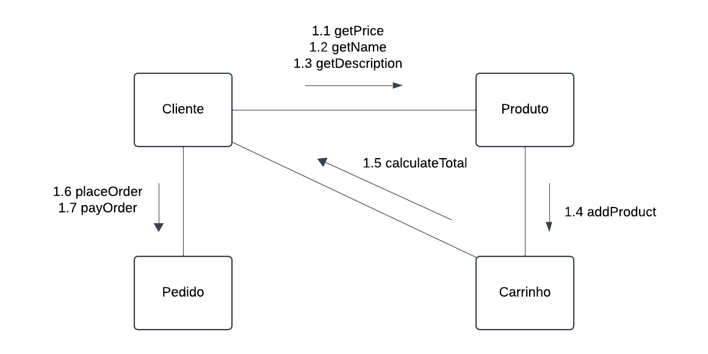
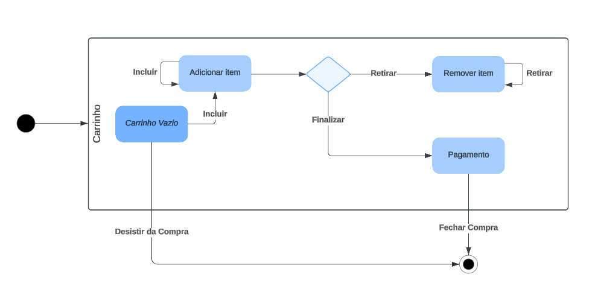

# 2.2. Módulo Notação UML – Modelagem Dinâmica

# 2.2.1 - Diagrama de Comunicação

## Introdução

Segundo Serrano (2024), o diagrama de comunicação é um diagrama dinâmico, ou seja, um diagrama de detalhes comportamentais. Ele mostra a interação entre objetos e/ou partes usando mensagens sequenciais.

É colocada ênfase na ordem das mensagens e, normalmente, o diagrama é feito com foco em um cenário de uso.

## Metodologia

A criação de um diagrama de comunicação segue etapas estruturadas que garantem a precisão e clareza do modelo. Os passos são listados a seguir.

### Determinar o cenário de uso

O primeiro passo é determinar o cenário de uso que será modelado, pois isso indica quais objetos serão necessários na representação.

### Identificar objetos necessários

Com o cenário de uso demarcado, é necessário determinar dentre os objetos do sistema quais são os necessários para que o cenário de uso possa acontecer.

### Modelar Interações

O passo seguinte é modelar as interações entre os objetos, organizando-as em sequência e explicitando quais métodos são usados em cada passo.

### Modelagem Visual do Diagrama

O passo final é usar uma ferramenta de modelagem UML para ilustrar visualmente o diagrama. A criação do mesmo se deu a partir de um trabalho conjunto entre os responsáveis por esse diagrama, com o uso do LucidChart como ferramenta de desenvolvimento.

## Diagrama

Foi elaborado o diagrama de comunicação do UnBrechó tendo em mente o cenário de uso de compra de um produto, que envolve os objetos Cliente, Produto, Carrinho e Order, conforme ilustrado na Figura 1 abaixo.

 <figcaption align="center">Figura 1 - Diagrama de Comunicação</figcaption>

<figcaption align="center">Fonte: <a href="https://github.com/LucasSpinosa" target="_blank">Lucas Spinosa</a>, <a href="https://github.com/LuizPettengill" target="_blank">Luiz Pettengill</a> e <a href="https://github.com/MarcoTulioSoares" target="_blank">Marco Tulio</a>, 2024.
</figcaption> 

Conforme apresentado, Cliente interage com Produto usando métodos para obter informações do mesmo. Em seguida, Produto é adicionado ao Carrinho de Compras, que por sua vez informa ao Cliente o valor dos produtos selecionados. Por fim, o Cliente reliza o Pedido e o paga.

# 2.2.2 - Diagrama de Estados

## Introdução

De acordo com os princípios da modelagem UML, um diagrama de estados é utilizado para representar o ciclo de vida de um objeto, destacando os estados que ele pode assumir e as transições entre esses estados. Este diagrama é fundamental para entender como o carrinho de compras do sistema de brechó UnBrechó responde às interações do usuário e aos eventos do sistema.

## Metodologia

A criação do diagrama de estados seguiu uma abordagem sistemática para garantir que todos os possíveis estados do carrinho fossem representados e todas as transições relevantes fossem mapeadas.

### Identificação dos Estados

Foram identificados os seguintes estados principais no ciclo de vida do carrinho:

1. Carrinho Vazio: Representa o estado inicial, onde nenhum item foi adicionado.
2. Adicionar Item: O estado transitório enquanto o usuário inclui itens no carrinho.
3. Remover Item: Representa a remoção de itens existentes no carrinho.
4. Pagamento: Estado onde o usuário finaliza a compra e insere os dados de pagamento.
5. Finalizado: O carrinho é concluído e o pedido é gerado.
6. Desistência: Estado em que o usuário cancela a compra, esvaziando o carrinho.

### Definição de Eventos e Transições

Cada estado é conectado por transições disparadas por eventos do usuário ou do sistema:

- Adicionar Item: Transição de "Carrinho Vazio" para "Adicionar Item".
- Remover Item: Transição de "Adicionar Item" ou "Pagamento" para "Remover Item".
- Finalizar: Transição de "Adicionar Item" para "Pagamento".
- Fechar Compra: Transição de "Pagamento" para "Finalizado".
- Desistir da Compra: Transição de qualquer estado para "Carrinho Vazio".

### Modelagem Visual do Diagrama

O diagrama foi modelado utilizando a ferramenta LucidChart, resultando em um fluxo claro e organizado que reflete o ciclo de vida do carrinho de compras.

---

## Diagrama

O diagrama dinâmico de estados apresenta os seguintes elementos:

1. Estado Inicial: Representado pelo símbolo de círculo preenchido.
2. Estados Finais: Representados por um círculo com borda dupla.
3. Transições: Mostram como o sistema responde a eventos como "Incluir", "Retirar" e "Finalizar".
4. Estados Intermediários: Como "Adicionar Item" e "Remover Item", que indicam ações em andamento.

---

 <figcaption align="center">Figura 2 - Diagrama de Estados do carrinho de compras.</figcaption>

<figcaption align="center">Fonte: <a href="https://github.com/Ericcs10" target="_blank">Eric Camargo</a>, <a href="https://github.com/M4RINH0" target="_blank">Douglas Marinho</a> e <a href="https://github.com/henriqtorresl" target="_blank">Henrique Torres</a>, 2024.
</figcaption> 

## Conclusão

O diagrama de estados do carrinho de compras permite visualizar como o sistema responde às interações do usuário e assegura a correta implementação do ciclo de vida do carrinho. Essa modelagem auxilia no desenvolvimento, testes e documentação do sistema, garantindo uma experiência de usuário fluida e eficiente.

# 2.2.3 Diagrama de sequência

## Introdução

Os diagramas de sequência são uma parte essencial da modelagem UML (Unified Modeling Language), representando a interação entre os objetos de um sistema ao longo do tempo. Ele representa os objetos envolvidos no processo e as mensagens trocadas entre eles, facilitando a compreensão do comportamento dinâmico do sistema.

## Metodologia

A construção do diagrama foi realizada com a ferramenta LucidChart e de forma assíncrona, de modo que cada envolvido em seu desenvolvimento contribuiu de modo individual. Ao final, as contribuições foram analisadas e unidas, a fim de criar a versão final do diagrama.

A metodologia utilizada para a criação de um diagrama de sequência envolve as etapas a seguir:

### Identificação do Escopo

Determinar o cenário ou funcionalidade que o diagrama deve representar e especificar os objetivos e as interações principais, como fluxos de login ou processamento de dados.

### Identificação de Elementos e Objetos

Listar os atores e objetos envolvidos no cenário. Além disso, para cada objeto, deve ser definido seu papel no processo e suas interações com outros elementos.

### Definição da Linha do Tempo

Estabelecer a sequência temporal das ações e organizar os eventos em ordem cronológica para que a lógica do processo fique clara.

### Modelagem das Mensagens e Chamadas

Representar cada interação entre os objetos e atores por setas (mensagens).

Usar mensagens síncronas e assíncronas, conforme necessário:

- Síncronas: quando o emissor aguarda uma resposta antes de continuar.
- Assíncronas: quando o emissor continua seu processo sem aguardar uma resposta imediata.

### Representação Visual no Diagrama

Utilização uma ferramenta de modelagem UML (LucidChart) para construir o diagrama.

Os elementos principais incluem:

- Objetos/Atores: representados como retângulos com linhas de vida verticais;
- Mensagens: setas horizontais indicando a troca de informações;
- Respostas: setas pontilhadas representando retornos ou confirmações.

### Validação e Refinamento

Compartilhar o diagrama com as partes interessadas para revisão e verificar se a sequência está lógica e completa. Realizar ajustes conforme necessário.

### Documentação e Uso Futuro

Anexar o diagrama à documentação do projeto e utilizá-lo como referência para o design do sistema, testes ou comunicação entre equipes.

## Diagrama

O diagrama de sequência elaborado pode ser conferido no Diagrama 1 abaixo. Devido ao tamanho do diagrama, optou-se por representá-lo de forma interativa para melhorar a visualização.

 <figcaption align="center">Diagrama 1 - Diagrama de Sequência</figcaption>

<iframe allowfullscreen frameborder="0" style="width:640px; height:480px" src="https://lucid.app/documents/embedded/ee41648b-4ed6-4303-bbb1-680bb1bd190c" id="UBvvva.Xz.KA"></iframe>

  

<figcaption align="center">Fonte: <a href="https://github.com/eduard0803" target="_blank">Eduardo Belarmino</a> e <a href="https://github.com/AnHoff" target="_blank">Ana Hoffmann</a>, 2024.
</figcaption> 

# 2.2.4 Diagrama de Atividades

## Introdução

Segundo Fakhroutdinov (2024), o diagrama de atividades é um diagrama de comportamento UML que mostra o fluxo de controle ou o fluxo de objetos com ênfase na sequência e nas condições do fluxo.

## Metodologia

Os diagramas de atividades são desenvolvidos para descrever desde o início até a conclusão das principais, como a busca e a compra de um produto. Essa representação não apenas mostra o fluxo entre os objetos, como também descreve a parte comportamental, representando-a como um fluxo de ações.

Ou seja, segundo Vanzandt (2024), diagramas de atividades UML são excelentes para ilustrar o fluxo contínuo de atividades, ações e processos em sistemas complexos, fluxos de trabalho comerciais ou qualquer processo dinâmico, com o principal diferencial de não apenas modelar a progressão de uma atividade para outra, mas também mostrar os pontos de decisão, os fluxos de controle e a interação diferenciada dos elementos.

## Diagrama

No Diagrama 2 abaixo é representado o fluxo completo de uma compra, começando pelo usuário procurando por um produto, até a finalização da compra.

 <figcaption align="center">Diagrama 2 - Diagrama de Atividades - Compra.</figcaption>

<iframe src="https://lucid.app/documents/embedded/a0a20314-76b7-40b3-88a4-2fbff0fada1d" style="top: 0; left: 0; width: 100%; height: 100%; position: absolute; border: 0;" allowfullscreen id="eJXuc2EWyXPb"></iframe>

<figcaption align="center">Fonte: <a href="https://github.com/marrcelo" target="_blank">Marcelo Magalhães</a>, 2024.
</figcaption> 

## Referências Bibliográficas 

> IBM Diagramas de Seqüência, 2024. Disponível em: [IBM Rational Software Modeler](https://www.ibm.com/docs/pt-br/rsm/7.5.0?topic=uml-sequence-diagrams). Acesso em: 26 nov. de 2024.

> FAKHROUTDINOV, Kirill. Activity Diagrams. Disponível em: https://www.uml-diagrams.org/activity-diagrams.html. Acesso em: 24 out. de 2024.

> Pressman, Roger S. Engenharia de Software: Uma Abordagem Profissional. 7. ed. São Paulo: McGraw-Hill, 2011.

> SERRANO, Milene. Arquitetura e Desenho de Software: AULA - MODELAGEM UML ESTÁTICA. Disponível em: <https://aprender3.unb.br/pluginfile.php/2928947/mod_page/content/1/Arquitetura%20e%20Desenho%20de%20Software%20-%20Aula%20Modelagem%20UML%20Est%C3%A1tica%20-%20Profa.%20Milene.pdf>. Acesso em: 26 nov. de 2024.

> VANZANDT, Paul. Activity Diagrams. Disponível em: https://ideascale.com/pt-br/blogue/diagrama-do-que-e-atividade/. Acesso em: 24 out. de 2024.

## Histórico de Versões

| Versão | Data       | Descrição              | Autor(es)                                                                                                                                          | Revisor(es)                                          | Resultado da Revisão                                         |
| ------ | ---------- | ---------------------- | -------------------------------------------------------------------------------------------------------------------------------------------------- | ---------------------------------------------------- | ---------------------------------------------------- |
| `1.0`  | 26/11/2024 | Adição do Diagrama de Comunicação | [LucasSpinosa](https://github.com/LucasSpinosa), [Marco Tulio](https://github.com/MarcoTulioSoares) e [Luiz Pettengill](https://github.com/LuizPettengill)  | [Ana Hoffmann](https://github.com/) | Aprovado para merge |
| `1.1`  | 27/11/2024 | Adição do Diagrama de Estados do carrinho | [Eric Camargo](https://github.com/Ericcs10), [Douglas Marinho](https://github.com/M4RINH0) e [Henrique Torres](https://github.com/henriqtorresl) | [Ana Hoffmann](https://github.com/) | Resolução de conflitos + ajustes de estilo da página |
| `1.2`  | 27/11/2024 | Adição do Diagrama de Sequência | [Eduardo Belarmino](https://github.com/eduard0803) e [Ana Hoffmann](https://github.com/AnHoff) |  |  |
| `1.3`  | 27/11/2024 | Adição do artefato Diagrama de Atividades | [Marcelo Magalhães](https://github.com/marrcelo) | [Ana Hoffmann](https://github.com/AnHoff)        |   Aprovação de PR          |