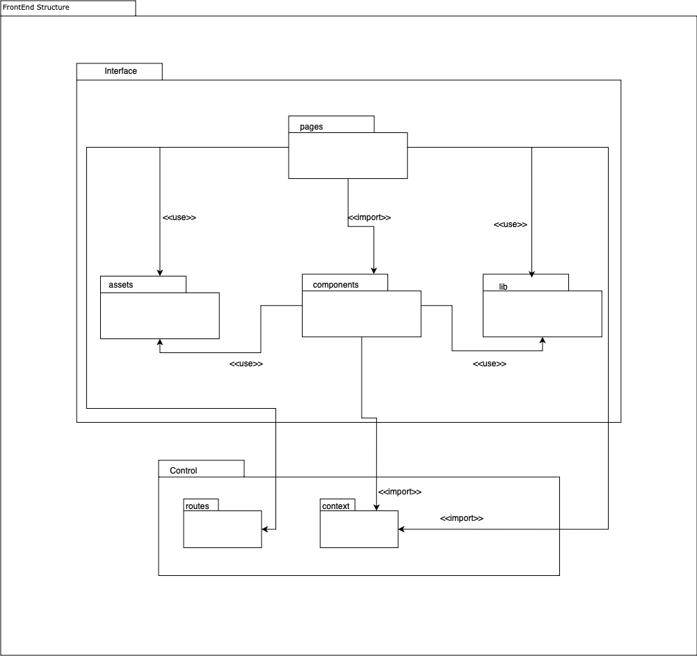
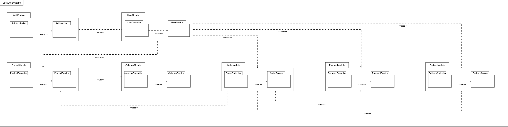

# 2.3. Módulo Notação UML – Modelagem Organizacional OU Casos de Uso

## 2.3.2 - Diagrama de Pacotes 

### Introdução 

Segundo Serrano (2024), o diagrama de pacotes se trata de um diagrama estrutural e estático que permite organizar o sistema, de forma a representar uma visão em módulos.

### Metodologia 

<!-- O diagrama foi feito pelo integrante Guilherme Evangelista a partir do site app.diagrams que permite criar vários diagramas , incluindo diagramas UML. -->

Sua criação envolve a identificação de pacotes e dependências, organização desses hierarquicamente, aplicação de princípios como baixo acoplamento e alta coesão, e representação visual das conexões. Essa abordagem facilita a compreensão da estrutura e melhora a comunicação entre equipes de desenvolvimento. O diagrama foi criado a partir do site app.diagramas.

### Diagrama de Pacotes Front-End

Foi elaborado um diagrama de pacotes do Front-End do UnBrechó de acordo com as tecnologia serão utilizadas, o React e seus hooks. Nos pacotes de interface gráfica haverá um pacote *pages* onde ficarão as páginas do software; um pacote de componentes que são pequenas parcelas de códigos importadas para as *pages*; os *assets* que serão usados tanto pelos *components* quanto pelas *pages*; e a parte das bibliotecas. Na parte de *controller*, haverá um pacote para os *contexts* do React e as rotas utilizadas pelas *pages*.

 

<figcaption align="center">Figura 1 - Diagrama de pacotes do front-end</figcaption>

<figcaption align="center">
 Fonte: <a href="https://github.com/guinuto" target="_blank">Guilherme Evangelista</a>, 2024.
</figcaption>

 

- pages usa assets;
- pages utiliza importações públicas de components
- pages usa rotas ;
- pages usa lib
- pages utiliza importações públicas do context
- components usa assets;
- components usa lib
- components utiliza importações públicas do context;

### Diagrama de Pacotes Back-End

 

<figcaption align="center">Figura 2 - Diagrama de pacotes do back-end</figcaption>

<figcaption align="center">
 Fonte: <a href="https://github.com/eduard0803" target="_blank">Eduardo Belarmino</a> e <a href="https://github.com/marrcelo" target="_blank">Marcelo Magalhães</a>, 2024.
</figcaption> 

- AuthModule usa UserModule
- AuthController usa AuthService
- UserController usa UserService
- UserModule usa ProductModule
- UserModule usa OrderModule
- UserModule usa PaymentModule
- UserModule usa DeliveryModule
- OrderModule usa ProductModule
- OrderModule usa PaymentModule
- OrderModule usa DeliveryModule
- ProductModule usa CategoryModule
- ProductController usa ProductService
- CategoryController usa CategoryService

# Referência Bibliográfica

 > SERRANO, Milene. Arquitetura e Desenho de Software: AULA - MODELAGEM UML ESTÁTICA. Disponível em: <https://aprender3.unb.br/pluginfile.php/2928947/mod_page/content/1/Arquitetura%20e%20Desenho%20de%20Software%20-%20Aula%20Modelagem%20UML%20Est%C3%A1tica%20-%20Profa.%20Milene.pdf>. Acesso em: 23 out. de 2024.

## Histórico de Versões

| Versão | Data | Descrição | Autor(es) | Revisor(es) | Resultado da Revisão |
| ------ | ---- | --------- | --------- | ----------- | -------------------- |
| `1.0`  | 26/11/2024 | Adição do Diagrama de Pacotes 1 | [Guilherme Evangelista](https://github.com/guinuto) | [Eduardo Belarmino](https://github.com/eduard0803) | Artefato revisado e validado para a entrega |
| `1.1` | 27/11/2024 | Atualização da Metodologia | [Eduardo Belarmino](https://github.com/eduard0803) | [Ana Hoffmann](https://github.com/AnHoff) | Revisão geral |
| `1.2` | 27/11/2024 | Adição do Diagrama de Pacotes 2 | [Eduardo Belarmino](https://github.com/eduard0803) | [Ana Hoffmann](https://github.com/AnHoff) | Revisão geral |
| `1.3` | 27/11/2024 | Evolução do Diagrama de Pacotes 2 | [Marcelo Magalhães](https://github.com/marrcelo) | [Ana Hoffmann](https://github.com/AnHoff) | Correções no texto e padronização de legendas, aprovado para merge |
