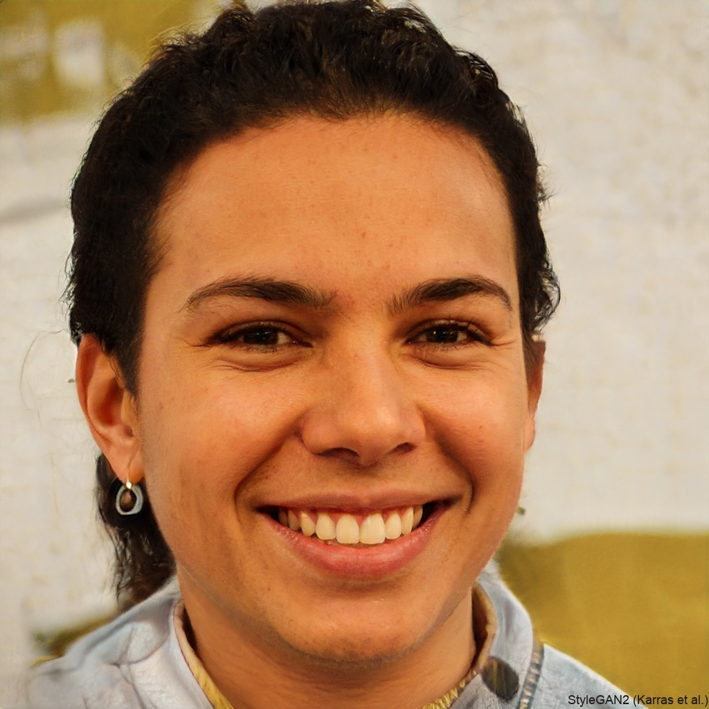

# Personas

## Introdução

As personas são representações semi-fictícias do cliente ideal de uma empresa ou produto. Elas ajudam a humanizar o processo de desenvolvimento de produtos, marketing e vendas, permitindo que as equipes compreendam melhor as necessidades, comportamentos e motivações de seus consumidores.

Ao criar personas detalhadas, as empresas podem desenvolver estratégias de comunicação mais eficientes e criar produtos que realmente atendam às expectativas de seu público-alvo.

## Objetivo

A criação de personas é uma ferramenta estratégica fundamental no processo de desenvolvimento de produtos e estratégias de marketing, pois permite que as empresas visualizem e compreendam seu público-alvo. Ao estabelecer perfis detalhados que representam diferentes segmentos de clientes ideais, as organizações conseguem direcionar seus esforços de maneira mais precisa, desenvolvendo soluções personalizadas que realmente ressoam com as necessidades de seus consumidores.

## Resultado

| Persona Primária 1 |  |
| :---- | :---- |
| **Foto**  | 
Figura 1: Marina Silva

  |
| **Nome**  | Marina Silva |
| **Gênero**| Feminino  |
| **Idade** | 25 anos|
| **Profissão**| Designer Gráfica|
| **Renda** | R$4.000|
| **Comportamento**  | Preocupada com sustentabilidade   Busca peças únicas e vintage   Ativa nas redes sociais   Valoriza marcas de qualidade por preços acessíveis |
| **Motivações**  | Reduzir impacto ambiental   Encontrar peças exclusivas   Economizar em marcas premium|

 
 

| Persona Primária 2 ||
| :---- | :----|
| **Foto**  | 
Figura 2: Ana Luiza Mendes

  |
| **Nome**  | Ana Luiza Mendes |
| **Gênero**| Feminino|
| **Idade** | 35 anos |
| **Profissão**| Analista de RH|
| **Renda** | R$5.500 |
| **Comportamento**  | Busca economia sem perder qualidade   Compra roupas infantis e brinquedos   Valoriza praticidade nas compras Preocupada com durabilidade |
| **Motivações**  | Economizar no orçamento familiar   Encontrar marcas boas por preços menores   Revender itens que os filhos não usam mais  |

 
 
 
|Persona Secundária 1||
| :---- | :---- |
| **Foto**  | 
Figura 3: Beatriz Costa

  |
| **Nome**  | Beatriz Costa  |
| **Gênero**| Feminino  |
| **Idade** | 19 anos|
| **Profissão**| Estudante universitária e Criadora de conteúdo |
| **Renda** | R$2.000|
| **Comportamento**  | Segue tendências da moda   Produz conteúdo para redes sociais  Busca looks únicos   Engajada com público jovem |
| **Motivações**  | Criar conteúdo diferenciado   Economizar em looks fashionistas   Promover consumo consciente |
  
 

|Persona Secundária 2||
| :---- | :---- |
| **Foto**  | 
Figura 4: Carlos Gomes 

  |
| **Nome**  | Carlos Gomes |
| **Gênero**| Masculino  |
| **Idade** | 55 anos|
| **Profissão**| Comerciante |
| **Renda** | R$12.000|
| **Comportamento**  | Especialista em antiguidades   Valoriza história dos objetos   Frequenta leilões e feiras   Networking com colecionadores |
| **Motivações**  | Expandir coleção pessoal   Encontrar peças raras   Investir em itens de valor histórico |
  
 

|Persona Secundária 3||
| :---- | :---- |
| **Foto**  | 
Figura 5: Fernanda Lima

  |
| **Nome**  | Fernanda Lima  |
| **Gênero**| Feminino  |
| **Idade** | 28 anos|
| **Profissão**| Tatuadora e Artista Plástica |
| **Renda** | R$4.500|
| **Comportamento**  |Estilo único e eclético   Busca peças para customização   Valoriza autenticidade   Interesse em moda dos anos 80/90 |
| **Motivações**  | Encontrar peças para upcycling   Criar looks autorais   Descobrir itens vintage para inspiração artística |
  
 

|Persona Secundária 4||
| :---- | :---- |
| **Foto**  | 
Figura 6: Pedro Oliveira 

  |
| **Nome**  |Pedro Oliveira |
| **Gênero**| Masculino  |
| **Idade** | 30 anos|
| **Profissão**| Revendedor online |
| **Renda** | R$6.000|
| **Comportamento**  | Compra para revender   Conhece tendências de mercado   Networking ativo   Foco em marcas premium |
| **Motivações**  | Lucrar com revenda   Identificar oportunidades de negócio   Construir relacionamento com fornecedores |
  
 

|Persona Secundária 5||
| :---- | :---- |
| **Foto**  | 
Figura 7: Roberto Santos 

  |
| **Nome**  |Roberto Santos |
| **Gênero**| Masculino  |
| **Idade** | 45 anos|
| **Profissão**| Professor universitário |
| **Renda** | R$16.000|
| **Comportamento**  | Apreciador de itens retrô   Colecionador de vinis e objetos vintage   Pesquisador meticuloso   Disposto a pagar mais por itens raros |
| **Motivações**  | Encontrar itens de colecionador   Resgatar memórias afetivas   Decorar ambientes com estilo retrô |
  
 

| Anti-Persona | |
|:---- | :---- |
| **Foto**  | 
Figura 8: Gabriel Santos

  |
| **Nome**  | Gabriel Santos |
| **Gênero**| Masculino|
| **Idade** | 23 anos  |
| **Profissão**| Vendedor de loja de departamento |
| **Renda** | R$3.000  |
| **Por que não é público-alvo** | Compra apenas em grandes redes de fast-fashion   Prioriza quantidade sobre qualidade   Descarta roupas rapidamente seguindo micro-tendências   Não se preocupa com sustentabilidade   Prefere sempre peças novas e da moda atual |

  
 

 

## Referências Bibliográficas

> BARBOSA, S. D. J.; SILVA, B. S. Interação Humano-Computador. Rio de Janeiro: Elsevier, 2011.
 
> This-Person-Does-not-Exist.com Dispónivel em: <https://this-person-does-not-exist.com/pt>.
 

 

## Histórico de Versão

| Versão | Data da alteração | Alteração | Responsável | Revisor | Data de revisão |
| :----: | :---------------: | :-------: | :---------: | :-----: | :-------------: |
| `1.0`  | 26/11/2024 | Criação das personas | [Marcelo Magalhães](https://github.com/marrcelo) e [Ana Hoffmann](https://github.com/AnHoff) | -- | -- |
