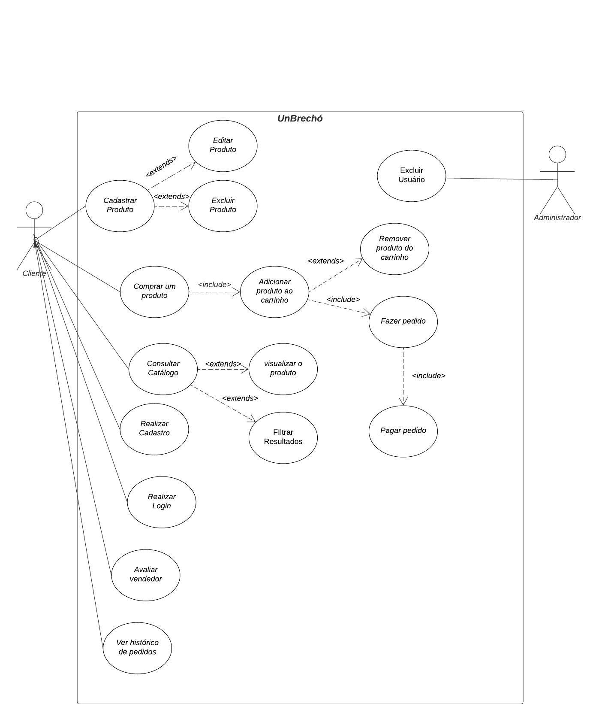
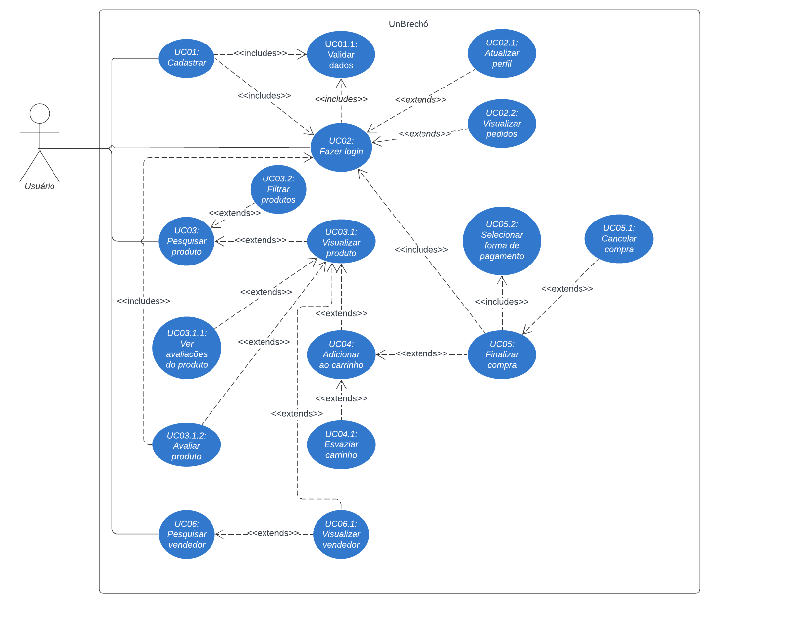
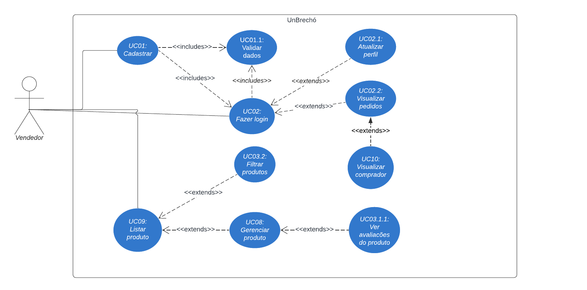

# 2.3.1 - Diagrama de Casos de Uso

## Introdução

Casos de uso são essenciais na modelagem de sistemas, ajudando a representar os requisitos funcionais de forma visual. Eles mostram como os usuários interagem com o sistema para alcançar objetivos específicos. De maneira simples, um caso de uso descreve as ações que o sistema realiza em conjunto com os usuários. Isso facilita a comunicação entre desenvolvedores e stakeholders, sendo crucial que seja claro e direto. Dito isso, um caso de uso é um documento que descreve a sequência de eventos de um ator que usa um sistema para completar um processo.

## Metodologia

Para a construção do diagrama de caso de uso, começamos identificando os principais usuários do sistema, como os usuários e os vendedores. Foram levados em consideração o perfil do usuário e as personas criadas para determinar os casos de uso que deveriam ser implementados. Em seguida, mapeamos as principais ações que cada um pode realizar dentro da plataforma UnBrechó, como: se cadastrar, fazer login, cadastrar produtos e visualizar pedidos. A ideia foi criar um diagrama simples e claro, que mostrasse como essas pessoas interagem com o sistema no dia a dia, ajudando a guiar o desenvolvimento da aplicação de forma prática e eficiente.

## Diagrama de Casos de Uso

<figcaption align="center">Figura 1 - Diagrama de casos de uso do usuário e administrador</figcaption>

<figcaption align="center">Fonte:
<a href="https://github.com/valdersonjr" target="_blank">Lucas Spinosa</a> <a href="https://github.com/MarcoTulioSoares" target="_blank">Marco Tulio</a> e <a href="https://github.com/LuizPettengill" target="_blank">Luiz Pettengill</a>, 2024.
</figcaption> 

<figcaption align="center">Figura 2 - Diagrama de casos de uso do usuário</figcaption>

<figcaption align="center">Fonte: 
<a href="https://github.com/AnHoff" target="_blank">Ana Hoffmann</a>, 2024.
</figcaption> 

<figcaption align="center">Figura 3 - Diagrama de casos de uso do vendedor</figcaption>

<figcaption align="center">Fonte:
<a href="https://github.com/valdersonjr" target="_blank">Valderson Junior</a>, 2024.
</figcaption> 

# Referência Bibliográfica

 > SERRANO, Milene. Arquitetura e Desenho de Software: AULA - MODELAGEM UML ESTÁTICA. Disponível em: <https://aprender3.unb.br/pluginfile.php/2928947/mod_page/content/1/Arquitetura%20e%20Desenho%20de%20Software%20-%20Aula%20Modelagem%20UML%20Est%C3%A1tica%20-%20Profa.%20Milene.pdf>. Acesso em: 23 out. de 2024.

 >UML: Casos de Uso Projeto de Sistemas de Software. [s.l: s.n.]. Disponível em: <https://moodle.unesp.br/pluginfile.php/25934/mod_resource/content/1/diagrama_casos_uso.pdf>.

 ## Histórico de Versões

| Versão | Data | Descrição | Autor(es) | Revisor(es) | Resultado da Revisão |
| ------ | ---- | --------- | --------- | ----------- | -------------------- |
| `1.0` | 28/11/2024 | Construção dos diagramas de Casos de Uso | [Valderson Junior](https://github.com/valdersonjr) e [Ana Hoffmann](https://github.com/AnHoff) | - | - |
| `1.1` | 29/11/2024 | Adição de Diagrama de Caso de Uso | [Lucas Spinosa](https://github.com/valdersonjr), [Marco Tulio](https://github.com/MarcoTulioSoares) e [Luiz Pettengill](https://github.com/LuizPettengill) | - | - |