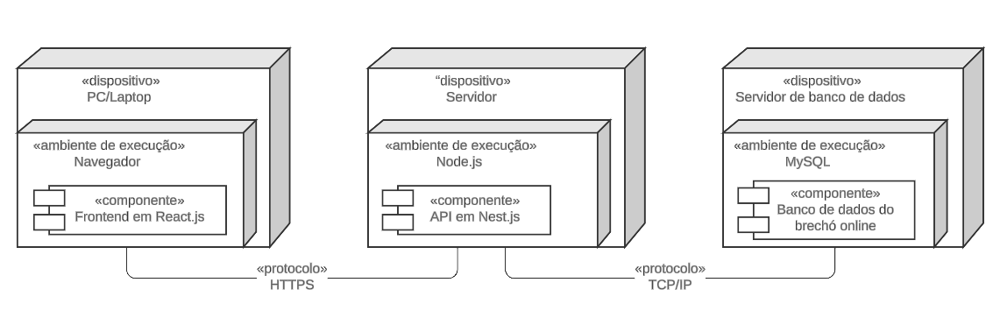

# 2.1.2 - Diagrama de Implantação

## Introdução

O diagrama de implantação é uma representação visual da infraestrutura do sistema, mostrando como os componentes do software são distribuídos e interagem com a parte física ou virtual onde são executados. Para o sistema de brechó online, esse diagrama ilustra como os usuários, servidores e banco de dados se conectam e se comunicam para garantir a operação eficiente e segura da plataforma de compras. Através desse diagrama, é possível entender como a arquitetura do sistema é organizada e como ele será executado em um ambiente real.

## Metodologia

A construção do diagrama de implantação seguiu as diretrizes da UML (Unified Modeling Language), que fornece uma notação padronizada para representar os componentes de software e suas interações no ambiente de execução. Para este diagrama, foram identificados os principais elementos de infraestrutura necessários para o funcionamento do sistema de brechó online: o usuário, o servidor web, o servidor de aplicação e o banco de dados.

O processo envolveu mapear a distribuição do sistema em um ambiente de implantação típico, conectando cada componente com as interações necessárias para a execução das funcionalidades, como o acesso ao front-end, a lógica de negócios no back-end e a persistência de dados no banco.

## Descrição

O diagrama de implantação do sistema de brechó online é composto pelos seguintes componentes principais:

- _Servidor Web_: Representado por um box (caixa retangular), o servidor web hospeda o front-end do sistema. Ele é responsável por exibir a interface ao usuário e gerenciar as requisições HTTP que vêm do navegador ou aplicativo.

- _Servidor de Aplicação_: Este componente executa a lógica de negócios e gerencia as interações com o banco de dados. Ele é representado como um box e recebe as requisições do servidor web para processá-las, realizando operações como autenticação de usuários, gerenciamento de carrinho de compras, etc.

- _Banco de Dados_: O banco de dados, representado por um cilindro, armazena as informações essenciais, como dados de usuários, produtos e transações. Ele é acessado pelo servidor de aplicação para consulta e atualização de dados.

## Diagrama

Foi elaborado o diagrama de implantação do UnBrechó, como pode ser visto na figura abaixo.

 <figcaption align="center">Figura 2 - Diagrama de Implantação.</figcaption>

<figcaption align="center">Fonte: <a href="https://github.com/Ericcs10" target="_blank">Eric Camargo</a> e <a href="https://github.com/henriqtorresl" target="_blank">Henrique Torres</a>, 2024.
</figcaption> 

# Histórico de Versões

| Versão | Data | Descrição | Autor(es) | Revisor(es) | Resultado da Revisão |
| ------ | ---- | --------- | --------- | ----------- | -------------------- |
| `1.0`  | 27/11/2024 | Adicionando diagrama de implantação | [Henrique Torres](https://github.com/henriqtorresl) e [Eric Camargo](https://github.com/Ericcs10) | [Douglas Marinho](https://github.com/M4RINH0) | Aprovar PR e adição de fonte para padronização de figuras. |