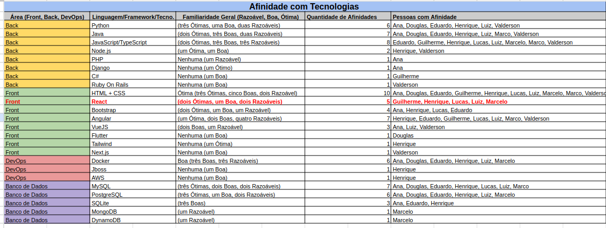

# 2.5.5 Familiaridade com Tecnologias

## Tabela de Familiaridade

Para definir quais serão as tecnologias que serão utilizadas na futura implementação do projeto, o grupo utilizou o Google Sheets pra criar uma tabela de familiaridades com tecnologias.

Cada membro registrou na tabela as linguagens/tecnologias que tinham familiaridade, sejam elas de Backend, Frontend, DevOps ou Banco de Dados, bem como nível de familiaridade (Razoável, Boa ou Ótima). Uma vez que todos os membros preencheram suas abas, foi feito um levantamento geral, verificando quantas vezes uma linguagem foi mencionada e quais foram suas familiriadades.

Com isso, o resultado foi a escolha de React para o Frontend e NestJS para o Backend.

A tabela pode ser acessada nesse [link](https://docs.google.com/spreadsheets/d/1sbqN-FHkM-0YT3E7UbmtY_nqu_e-U-sh/edit?usp=sharing&ouid=107161398661536384520&rtpof=true&sd=true).

# Histórico de Versões

| Versão | Data | Descrição | Autor(es) | Revisor(es) | Resultado da Revisão |
| ------ | ---- | --------- | --------- | ----------- | -------------------- |
| `1.0`  | 29/11/2024 | Criação do documento | [Lucas Spinosa](https://github.com/LucasSpinosa) | --- | --- |