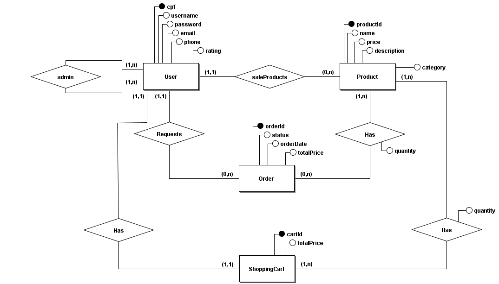

# 2.5.3 Modelagem do Banco de Dados

## Introdução

O presente documento se refere à modelagem inicial do banco de dados, sendo baseado nos documentos de modelagem criados para esta entrega (02). A principal referência para a modelagem do banco de dados foi o [Diagrama de Classe](Modelagem/DiagramaClasse).

## Metodologia

Um bom projeto de banco de dados começa pela definição do modelo entidade-relacionamento (ME-R), seguido pelo diagrama entidade-relacionamento (DE-R) e, por fim, há a elaboração do diagrama lógico de dados (DLD). Confira a seguir o que foi elaborado.

### Modelo Entidade-Relacionamento (ME-R)

O ME-R é uma abordagem conceitual para modelar dados, utilizado para descrever as estruturas de um banco de dados e suas interações. Ele define os dados por meio de entidades (objetos ou conceitos do mundo real), seus atributos (características das entidades) e os relacionamentos (associações entre as entidades). Este modelo é amplamente utilizado no processo de análise e design de sistemas, pois permite representar a lógica de negócios de forma visual e compreensível antes da implementação técnica.

As entidades e atributos estão litados abaixo.

### 1. User
- **Atributos**:
  - cpf (PK)
  - username
  - password
  - email
  - phone
  - rating
- **Relacionamentos**:
  - Relaciona-se com **Product** (1:N) - "saleProducts".
  - Relaciona-se com **Order** (1:N).
  - Relaciona-se com **ShoppingCart** (1:1).

---

### 2. Product
- **Atributos**:
  - productId (PK)
  - name
  - price
  - description
  - category
- **Relacionamentos**:
  - Relaciona-se com **User** (N:1) - Produtos vendidos pelo usuário.
  - Relaciona-se com **Order** (N:M).
  - Relaciona-se com **ShoppingCart** (N:M).

---

### 3. Order
- **Atributos**:
  - orderId (PK)
  - orderDate
  - status
  - totalPrice
- **Relacionamentos**:
  - Relaciona-se com **Product** (N:M).
  - Relaciona-se com **User** (N:1).

---

### 4. ShoppingCart
- **Atributos**:
  - cartId (PK)
  - totalPrice
- **Relacionamentos**:
  - Relaciona-se com **Product** (N:M).
  - Relaciona-se com **User** (1:1).

---

### 5. Admin
- **Atributos**:
  - Sem atributos específicos no diagrama.
- **Relacionamentos**:
  - Pode excluir usuários por meio da operação `deleteUser`.

---

## Relacionamentos

### 1. User possui Product
- **Grau**: 1:N
- **Descrição**: Um usuário pode ter vários produtos à venda.

---

### 2. User realiza Order
- **Grau**: 1:N
- **Descrição**: Um usuário pode realizar várias ordens de compra.

---

### 3. User possui ShoppingCart
- **Grau**: 1:1
- **Descrição**: Cada usuário tem um único carrinho de compras.

---

### 4. Product está em ShoppingCart
- **Grau**: N:M
- **Descrição**: Um produto pode estar em vários carrinhos, e um carrinho pode conter vários produtos.

---

### 5. Product está em Order
- **Grau**: N:M
- **Descrição**: Um produto pode estar em várias ordens, e uma ordem pode conter vários produtos.

---

### 6. Admin gerencia User
- **Grau**: 1:N
- **Descrição**: O administrador tem permissão para excluir usuários.

---

## Diagrama Entidade-Relacionamento (DE-R)

O diagrama entidade-relacionamento (DER) é uma representação gráfica do modelo ER. Ele utiliza elementos visuais, como retângulos para entidades, elipses para atributos e losangos para relacionamentos, conectados por linhas que indicam as associações. O DER facilita a comunicação entre desenvolvedores, analistas e stakeholders, ajudando a identificar requisitos de dados e validar o design do banco de dados. Ele também é essencial para documentar a estrutura de um sistema. A Figura 1 abaixo apresenta o diagrama desenvolvido para o UnBrechó.

 <figcaption align="center">Figura 1 - Diagrama DE-R.</figcaption>

<figcaption align="center">Fonte: <a href="https://github.com/AnHoff" target="_blank">Ana Hoffmann</a>, 2024.
</figcaption> 

# Histórico de Versões

| Versão | Data       | Descrição              | Autor(es)                                                                                                                                          | Revisor(es)                                          | Resultado da Revisão                                         |
| ------ | ---------- | ---------------------- | -------------------------------------------------------------------------------------------------------------------------------------------------- | ---------------------------------------------------- | ---------------------------------------------------- |
| `1.0`  | 28/11/2024 | Adição do DER | [Ana Hoffmann](https://github.com/) | [Eduardo Belarmino](https://github.com/eduard0803) | Aprovação de PR |
